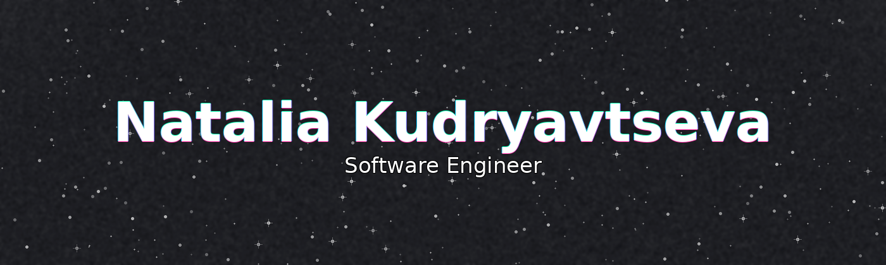

  

  <!-- TODO: replace links when ready -->
  
  
  
  
  

  

### Skills

- **Core Frontend:** React, Vue.js, Svelte, TypeScript, Next.js, Nuxt.js (SPA / SSR / SSG)
- **State Management:** Redux, MobX, Pinia, TanStack Query, SWR
- **Styling & UI:** Tailwind CSS, SCSS, shadcn/ui, Headless UI, Material UI, Chakra UI *(familiar with: Ant Design, Radix UI, Styled Components, Bootstrap)*
- **Testing & Quality:** Jest, Vitest, React Testing Library, Cypress, Playwright, ESLint, Prettier, Husky, lint-staged
- **Backend & APIs:** Node.js (Express.js, Nest.js), REST API, GraphQL (Apollo Client / Server), tRPC, PostgreSQL, MongoDB, MySQL, Prisma, Supabase, Firebase, Convex, Strapi
- **Validation:** Zod, Yup
- **AI & Integrations:** LLM APIs (OpenAI, Anthropic), LangChain, LlamaIndex, RAG pipelines (vector databases, retrieval, evaluation), AI feature integration (frontend + backend)
- **Build & Deployment:** Webpack, Vite, Docker, CI/CD (GitHub Actions / GitLab CI), Vercel, Netlify
- **Architecture & Best Practices:** Component-driven development, Storybook, Micro-frontends, Web Performance Optimization, Accessibility (a11y), Core Web Vitals, SEO basics
- **Cloud / Edge:** Cloudflare, AWS Lambda, Edge Functions
- **Version Control:** GitHub, GitLab, Bitbucket

