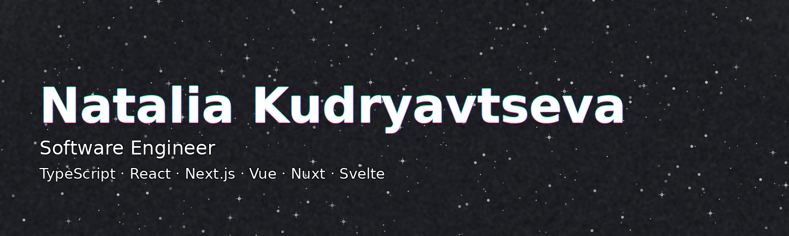

  

  <!-- TODO: replace links when ready -->
  
  
  
  
  

  

### Skills

- **Frontend:** React, Vue.js, Svelte, TypeScript, Next.js, Nuxt.js, Express.js, Nest.js, Three.js
- **State management:** Vuex, Redux, MobX, Pinia
- **Styling:** HTML, CSS, Sass (SCSS), Stylus, Tailwind CSS, Bootstrap
- **Testing:** Jest, Vitest, React Testing Library, Cypress, Playwright
- **Build / Dev tools:** ESLint, Prettier, Husky, lint-staged, npm, pnpm, yarn
- **API / Data fetching:** REST API, Axios, TanStack Query (React Query), SWR, Apollo Client, tRPC
- **UI libraries:** Material UI, Ant Design, Chakra UI, Radix UI, shadcn/ui, Headless UI
- **DB / Backend services:** PostgreSQL, MySQL, GraphQL, Strapi, MongoDB, Supabase, Firebase, Convex
- **Bundlers:** Webpack, Vite
- **Version control:** GitHub, GitLab, Bitbucket
