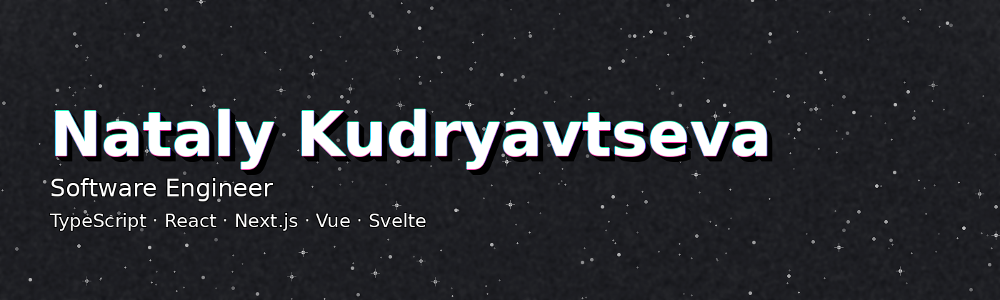

  

<h1 align="center">Nataly Kudryavtseva</h1>

<b>Software Engineer</b>

  <!-- TODO: replace links when ready -->
  
  

  

---

### Stack

<!-- Icon style like in your examples: rounded squares -->

**Frontend**

  

**Backend / Data**

  

**Tooling / Platform**

  

